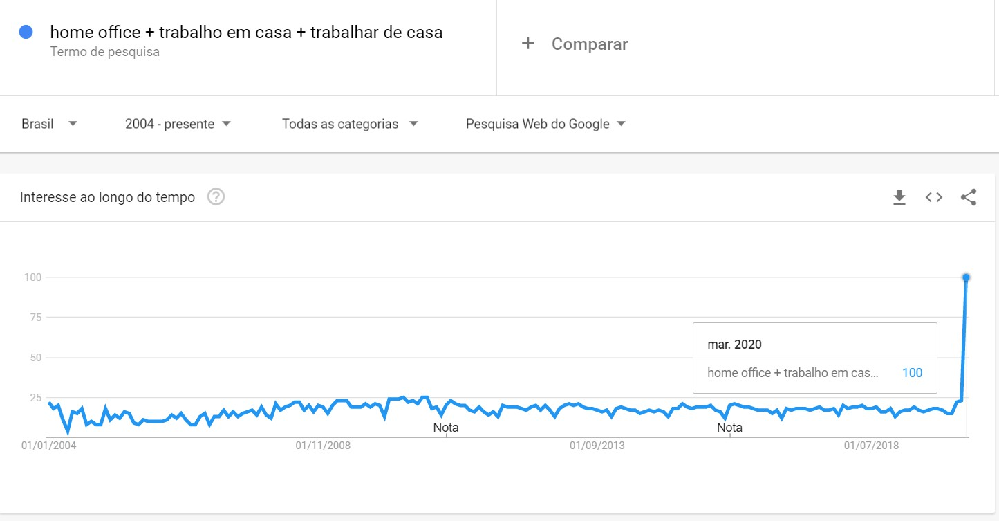
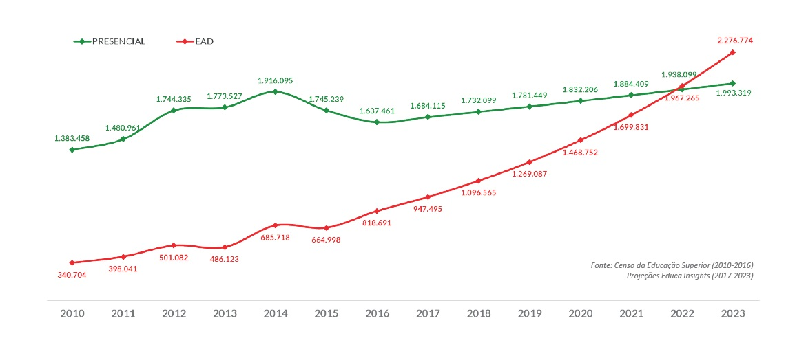

## Introdução

 No último ano, o dia a dia da população mudou drasticamente devido a pandemia da COVID-19. Dentre essas mudanças, destacamos a adoção do <i>home office</i> e da educação a distância, motivadas pela necessidade de isolamento social. Ambas as atividades foram implantadas muito rapidamente e com pouco tempo de adaptação, e inúmeras pessoas que não possuem conhecimento algum sobre computadores esbarraram no problema de ter de adquirir uma máquina que atenda suas necessidades. Esse público muitas vezes não sabe que hardware irá lhe satisfazer, qual o valor justo de um equipamento ou que há a possibilidade de melhorar um computador antigo, ao invés de comprar um totalmente novo. Para lidar com este problema, será criada uma aplicação web que visa levar conhecimento e auxiliar o público a tomar uma decisão consciente, através de tutoriais e recomendações singulares, de forma clara e simples. Assim, mais pessoas conseguirão realizar suas tarefas eficientemente, e o impacto do isolamento social para este recorte específico será diminuído.

## Problema

Atualmente, muitas pessoas são lesadas pela falta de conhecimento e compram hardwares inadequados para sua situação, seja que não atendem sua necessidade, ou então custe mais do que necessário. Outro fator problemático é a ignorância sobre a compatibilidade de componentes, que muitas vezes leva à compra de um componente incapaz de ser usado no computador atual.
Sendo assim, o nosso projeto possui intuito de contrapor o problema da falta de informação e também dos gastos desnecessários.

## Objetivos

A pretensão desse projeto é proporcionar, através de uma aplicação web simples e intuitiva, conhecimento sobre hardware e sugestões personalizadas de melhorias, com o foco em pessoas leigas que se encontram em atividade remota. Assim, beneficiará os usuários no processo de se adquirir ou melhorar um computador, de forma consciente e evitando gastos desnecessários.
 

Especificamente, iremos atender dois pontos:
 
  
- Recomendar ao usuário opções de upgrade que irão satisfazer suas necessidades, levando em consideração o hardware que ele já possui e sua área de atuação;
 
  
- Oferecer meios para que o usuário aprenda sobre hardware e sua importância em um computador, de forma acessível e clara para leigos no assunto.
 
 

## Justificativa

No último ano, devido a pandemia do coronavírus, um grupo enorme de pessoas que não estava familiarizada com computadores se viu na necessidade de usá-los diariamente, seja para trabalho ou estudos. A Figura 1 indica as buscas pelo termo <i>home office</i>, no Google, entre os anos 2004 e 2020. Podemos ver que nos últimos 16 anos não houve crescimento significativo das pesquisas pelo termo, porém em março de 2020, período que corresponde as primeiras iniciativas de isolamento social, ocorreu uma explosão nas buscas. Na Figura 2, temos um gráfico de previsão até 2023 para as matrículas em instituições privadas, comparando a modalidade presencial com a modalidade EAD, com base nos anos de 2010 em diante. Podemos ver uma crescente elevada para a modalidade EAD, indicando que irá superar a quantidade de matrículas presenciais em 2023.

Pesquisa por '<i>home office</i>' ao longo dos anos            |  Previsão para o crescimento de matrículas EAD
:-------------------------:|:-------------------------:
Figura 1 - RENNAN A. JULIO - **Brasil nunca pesquisou tanto o termo "<i>home office</i>" no Google**. 2020. Disponível em: https://epocanegocios.globo.com/Empresa/noticia/2020/04/brasil-nunca-pesquisou-tanto-o-termo-home-office-no-google.html. Acessado em 11/04/2020.  | Figura 2 - ESAB - **Em 2023 as instituições privadas terão mais alunos no ensino à distância que no presencial, indica pesquisa da ABMES**. 2018. Disponível em: https://esab.edu.br/em-2023-as-instituicoes-privadas-terao-mais-alunos-no-ensino-a-distancia-que-no-presencial-indica-pesquisa-da-abmes/. Acessado em 11/04/2020

## Público-Alvo

Qualquer pessoa que deseje adquirir um computador ou realizar um upgrade poderá se beneficiar desse projeto, inclusive aquelas que já possuem algum conhecimento na área. Porém, estabeleceu-se que o foco dessa solução será para pessoas leigas em questões técnicas sobre hardware, que estão inseridas no mercado de trabalho ou ambiente acadêmico, que não estão familiarizadas com o contexto computacional, e que se encontram na necessidade usar um computador para <i>home-office</i> ou aulas EAD, em grande parte motivada pela situação global de pandemia e isolamento social. 

